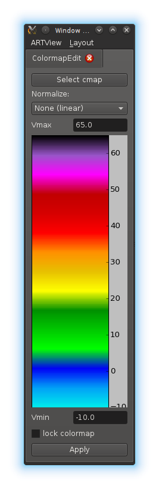
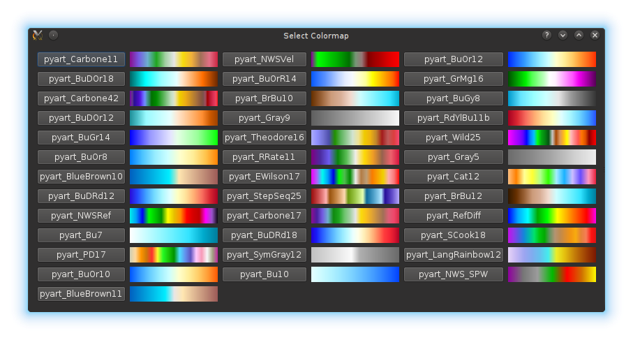
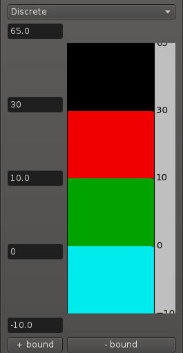

ColormapEdit Tutorial
=====================

This Tutorial introduces the use of the `ColormapEdit` Plugin, for advanced editing. More basic feature are present in the display component it self.

Open
----

You will find the ColormapEdit in the modes `Edit Colormap (radar)` or `Edit Colormap (grid)`, depending on whether you if want to conect it to a `RadarDisplay` or a `GridDisplay`

Function
--------

It allows you to:

- Change the Color graduation
- Change the Scale between: Linear, Logarithmic, Symmetric logarithmic, Power-law and Discrete
- Set Parameters:
  - vmin, vmax: smallest and greatest value shown
  - linthresh, linscale (Symmetric Logarithmic): size and slop of linear region around origin
  - gamma (Power-Law): exponent
- Lock Colormap to prevent artview to reset it when changing fields

Changes in the paramets will affect the shown colormap, but only afect the display by pressing `Apply`

Choosing Color graduation
-------------------------

We only support the colormaps provided by `pyart`, hopely that is enough. The widget to select a colormap looks like this

Discrete Colormaps
------------------

Thw widget to configure discrete colormaps looks like this:

You can change the value of color bounds and add/remove bounds. Try to maintain the bounds decreassing from top to bottom. There is current no way o changing to color directly, but you can select a diferent graduation, that will result in diferent colors.

